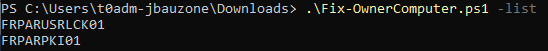
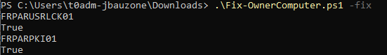

Fix-OwnerComputer.ps1
===================

Fix-OwnerComputer.ps1 can list and fix the computers objects where owner is not Domain Admins.

For each computer where owner is not Domain Admins group, It will then retrieve the computer name.


##Examples
Using the script to list computers with owner is not Domain Admins:
```PowerShell
Fix-OwnerComputer.ps1 -List
```


Using the script to List and Fix computers with owner is not Domain Admins:
```PowerShell
Fix-OwnerComputer.ps1 -Fix
```



Get-AzureADGroupEmpty.ps1
===================

Get-AzureADGroupEmpty.ps1 can list empty sync and cloud groups in Microsoft Entra.

For each group without members, It will then retrieve the name group.


##Examples
Using the script to list synced groups without members:
```PowerShell
Get-AzureADGroupEmpty.ps1 -ListSync
```

Using the script to list Cloud groups without members:
```PowerShell
Get-AzureADGroupEmpty.ps1 -ListCloud
```

Using the script to Remove synced groups without members:
```PowerShell
Get-AzureADGroupEmpty.ps1 -Remove
```

